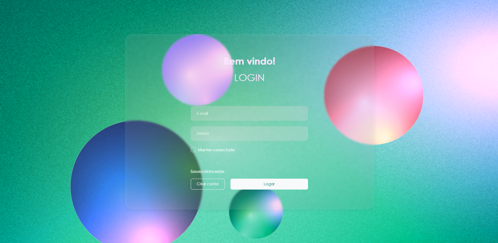
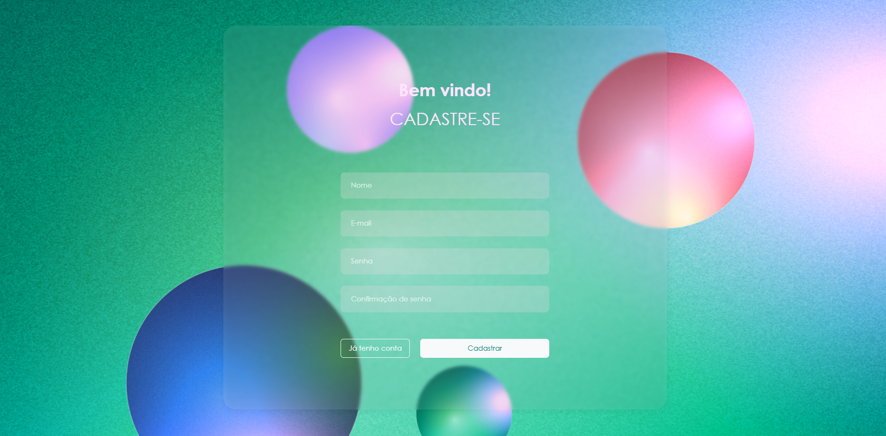
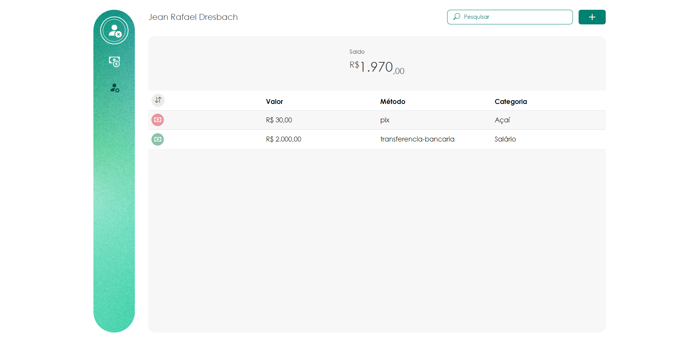
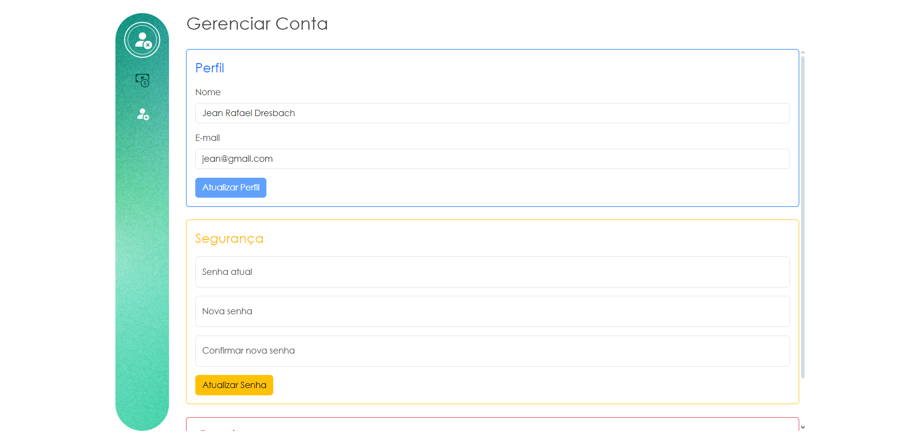

<div align="center">

# Columbus Transaction App

### Preview






</div>

## 💻 Tecnologias Utilizadas

-   
-   
-   
-   
-   [](https://axios-http.com)

## 🛠️ Clonagem e Instalação via GitHub

```console
git clone https://github.com/Jean-Dresbach/Columbus-Transaction-Front-End.git
```

Após clonar o repositório, instale as dependências usando o Yarn com o seguinte comando:

```console
npm install
```

## 💡 Funcionalidades

### Transações:

-   Adicionar nova transação.
-   Editar transação existente.
-   Excluir transação.
-   Visualizar todas as transações de um usuário.

### Usuários:

-   Registrar novo usuário.
-   Editar usuário existente.
-   Excluir conta de usuário.
-   Visualizar todas as informações do usuário.

## 🚀 Executando a Aplicação

Para executar a aplicação, você precisa instalar e iniciar a API [Columbus-Transactions-Back-End](https://github.com/Jean-Dresbach/Columbus-Transactions-Back-End) em sua máquina. Certifique-se de seguir as instruções de instalação e inicialização fornecidas no repositório do backend antes de prosseguir para o lançamento da aplicação.

Isso garantirá que o aplicativo frontend tenha acesso às funcionalidades necessárias para funcionar corretamente. Uma vez configurado o backend, você está pronto para iniciar a aplicação frontend e explorar todos os seus recursos!

👾 Desenvolvido por [Jean Rafael Dresbach](https://www.linkedin.com/in/jean-rafael-dresbach/).
